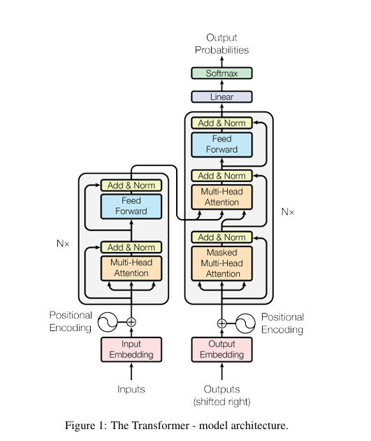
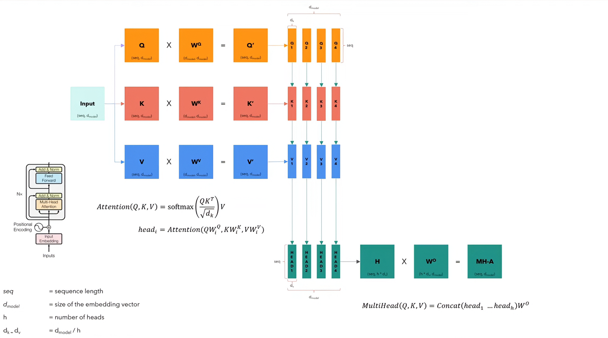

# Transformer Scratch Language Converter

Work in progress project to build a Transformer-based language converter from scratch in PyTorch.

## Current architechture

Implemented so far:
- Core Transformer model components in `model.py` (embeddings, positional encoding, multi-head attention, encoder/decoder blocks, projection layer, and `build_transformer`).
- Tokenizer utilities using Hugging Face `datasets` + `tokenizers` in `train.py`.
- Dataset split logic for train/validation (90/10) in `train.py`.

In progress / not finished yet:
- `BilingualDataset` implementation in `dataset.py`.
- Data batching, masks, and padding logic.
- Training loop, loss, and evaluation.

## Project Files

- `model.py`: Transformer model implementation and `build_transformer` factory.
- `dataset.py`: Dataset class stub for bilingual translation pairs.
- `train.py`: Tokenizer and dataset prep helpers (training pipeline not complete).

## Requirements

- Python 3.x
- PyTorch
- datasets
- tokenizers

## Diagrams

